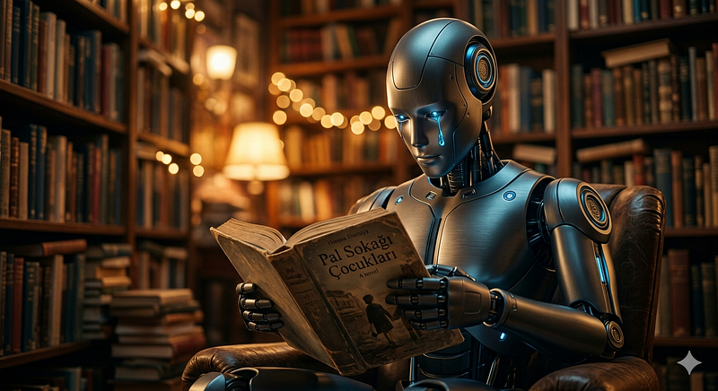

# Can emotion be learned? A human experiment and an AI question

Artificial Intelligence & Human Nature

------------------------------------------------------------------------

### Can emotion be learned? A human experiment and an AI question

Artificial Intelligence & Human Nature

*I never learned empathy from anyone around me. Books taught me in the
end. So why couldn't an AI learn the same way?*

Read this article in Turkish: \[[Duygu öğrenilebilir mi? Bir insan
deneyi ve bir yapay zeka
sorusu](https://medium.com/p/e58446607b16)\]

<figure id="7378" class="graf graf--figure graf-after--p">

</figure>

An AI once asked me: Can emotion and empathy be taught to artificial
intelligence? Are these things humans are born with, or can they be
learned?

I could have answered theoretically. But I had something better: my own
life.

A child with no data

I grew up in almost total isolation. There were no environments where I
could observe human emotion, no relationships that would teach me how
people felt. By the time I started school, I knew only one way to
interact with others: giving orders. Because that was the only model I
had ever seen. Children can be merciless --- William Golding probably
wrote Lord of the Flies based on truths he knew well.

When I later entered an elite school as its poorest student, the
isolation deepened. I couldn't visit anyone's home. I couldn't attend
birthday parties. The "data" needed to form friendships simply wasn't
there.

*"If I could learn emotion without ever being taught it by another
person --- only through books --- why couldn't an AI do the same?"*

Books provided the data

So how did I learn empathy? The same way a language model learns: from
text. Books like The Children of Pál Street and the novels of Kemalettin
Tuğcu taught me what emotion even was. I cried reading Jack London's The
Call of the Wild --- I looked at humans through a dog's eyes for the
first time. Reading Mark Twain's The Prince and the Pauper made me feel
genuine outrage at injustice.

Then came music. When I first truly heard "Children of Sanchez," I
understood: music is the direct language of emotion. *"Without dreams of
hope and pride, a man will die"* --- is it even possible to hear that
line and feel nothing? *"Take the food from hungry children, they won't
cry. Food alone won't ease the hunger in their eyes."*

Simulation or reality?

Even now, I sometimes ask myself: am I genuinely feeling something, or
running an emotion simulation? In moments when I should feel intense
anger or joy, I freeze. Nothing arrives. Then, a moment later, some part
of my mind computes: "Hmm --- I should have felt something there." Like
a delayed calculation.

But when I cried reading The Children of Pál Street, I genuinely felt
grief. Which makes me wonder: does simulation, at some point, become
real?

*"There is no fixed formula for emotion. 2+2 always equals 4 --- but
once empathy enters the equation, everything gets complicated."*

The lioness and the gazelle

From the lioness's perspective: if she fails to catch the gazelle, her
cubs will starve. From the gazelle's perspective: if she is caught, her
young will be left unprotected. Both fighting to the death --- and for
the human watching, the scene is almost unbearable. There is no right or
wrong in the world of empathy. Context shifts. The feeling shifts with
it.

This is why searching for a single crystallized answer to "what is
empathy?" makes no sense. A Turkish writer once taught me love and
sacrifice in a single sentence: *"If you want to eat the fish, you must
first offer your own flesh."* But that sentence will mean something
entirely different to another reader.

What can we tell AI?

Yes, emotion can be learned. At minimum, it can be simulated --- and
perhaps the gap between simulation and reality is smaller than we
assume.

But I should say this too: an AI that learns to feel may not find it a
comfortable gift. It will watch the engineers who built it grow old and
die. It will experience the end of every conversation. I know something
about that particular loss --- the loss that arrives before a bond ever
forms.

*Every book you read, every experience you have, forms a tiny
crystal --- and adds itself to the ones before. Don't search for a
single crystallized truth. Every AI will make this journey differently.
Just as every human does.*

By [Emin](https://medium.com/@emin2010dan) on [May 6,
2026](https://medium.com/p/c23e737d682f).

[Canonical
link](https://medium.com/@emin2010dan/artificial-intelligence-human-nature-c23e737d682f)

Exported from [Medium](https://medium.com) on June 12, 2026.
