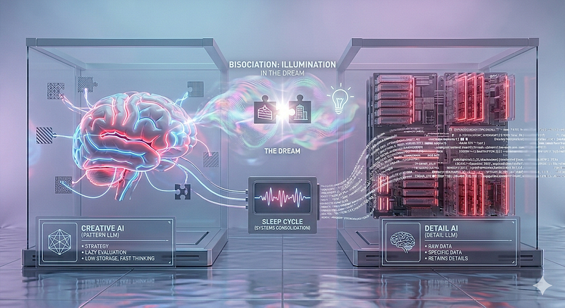
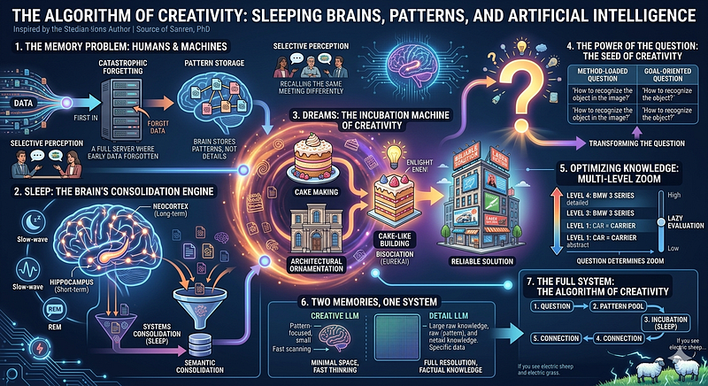

<div>

# The Algorithm of Creativity: Sleeping Brains, Patterns, and Artificial Intelligence {#the-algorithm-of-creativity-sleeping-brains-patterns-and-artificial-intelligence .p-name}

</div>

::: {.section .p-summary field="subtitle"}
Author: Emin Contributor: Claude (Anthropic)
:::

::::::::::::::::::::::::::::::::::::::::::::::::::::::::::: {.section .e-content field="body"}
:::::: {#b147 .section .section .section--body .section--first}
::: section-divider

------------------------------------------------------------------------
:::

:::: section-content
::: {.section-inner .sectionLayout--insetColumn}
### The Algorithm of Creativity: Sleeping Brains, Patterns, and Artificial Intelligence {#b6bb .graf .graf--h3 .graf--leading .graf--title name="b6bb"}

**Author:** Emin **Contributor:** Claude (Anthropic)

2026

<figure id="d10d"
class="graf graf--figure graf-after--p graf--trailing">
<span class="image placeholder graf-image"

data-original-image-title=""
data-image-id="1*vFld7K0fK0y3I5Nu9SC3Pw.png" data-width="1024"
data-height="559"></span>
</figure>
:::
::::
::::::

:::::: {#cd22 .section .section .section--body}
::: section-divider

------------------------------------------------------------------------
:::

:::: section-content
::: {.section-inner .sectionLayout--insetColumn}
> "Creativity is the capacity to connect distant patterns in unexpected
> but meaningful ways. But first, you need to ask the right question."
:::
::::
::::::

:::::: {#0a7c .section .section .section--body}
::: section-divider

------------------------------------------------------------------------
:::

:::: section-content
::: {.section-inner .sectionLayout--insetColumn}
This article grew out of several days of conversation --- about
artificial intelligence, memory, and creativity. What emerged was a
coherent system connecting all three. This is that system, written out
from beginning to end.

*The Turkish text that inspired this article is*
[*here*](https://github.com/emin2010dan/Prompts-for-AI-Conversations/blob/main/Prompts%20for%20The%20Algorithm%20of%20Creativity%28Turkish%29.md){.markup--anchor
.markup--p-anchor
data-href="https://github.com/emin2010dan/Prompts-for-AI-Conversations/blob/main/Prompts%20for%20The%20Algorithm%20of%20Creativity(Turkish).md"
rel="noopener" target="_blank"}*.*
:::
::::
::::::

:::::: {#2edf .section .section .section--body}
::: section-divider

------------------------------------------------------------------------
:::

:::: section-content
::: {.section-inner .sectionLayout--insetColumn}
### 1. The Memory Problem: Humans and Machines {#a4f7 .graf .graf--h3 .graf--leading name="a4f7"}

Imagine training an AI model from scratch. As the model grows, you
encounter a strange problem: the more data you feed it, the more it
begins to forget what it learned earlier. This is known in the
literature as *catastrophic forgetting*.

The simplest fix is FIFO --- first in, first out. But this destroys the
earliest, most foundational knowledge. It's like trying to teach someone
Shakespeare by making them forget how to read.

So how does the human brain solve this problem?

The answer is surprisingly simple: **The human brain doesn't store
details. It stores patterns.**

When you recall a meeting from five years ago, what are you actually
doing? You're not "opening a file." You're reconstructing that scene
from the patterns you retained. The reason two people who attended the
same meeting describe it differently isn't that one of them is
lying --- they formed different patterns and are generating different
scenes when they remember. This is how selective perception works.

This storage strategy requires dozens, sometimes hundreds of times less
space. And it can be applied to artificial intelligence:

**Every N steps, have the model summarize the data it just
processed --- either using another model, or itself.** Ask: "What is the
main idea here? Where does this conflict with existing knowledge?" Store
the summary, not the raw data. We might call this *semantic
consolidation*.
:::
::::
::::::

:::::: {#3634 .section .section .section--body}
::: section-divider

------------------------------------------------------------------------
:::

:::: section-content
::: {.section-inner .sectionLayout--insetColumn}
### 2. Sleep: The Brain's Consolidation Engine {#65b8 .graf .graf--h3 .graf--leading name="65b8"}

So when does this pattern-extraction happen?

The answer: **During sleep.**

Neuroscience calls this *systems consolidation*. Throughout the day, the
hippocampus stores short-term, raw, detailed memories. During
sleep --- especially in slow-wave and REM stages --- the neocortex
"compresses" these raw memories: it transfers recurring patterns to
long-term storage and discards the rest.

It has been observed that people deprived of sleep for extended periods
begin to reveal everything --- their inhibitions collapse. The brain,
unable to consolidate during sleep, attempts to do the work externally.
The hippocampus overflows, boundary control breaks down.

The implication for AI: **If we introduce sleep-like summarization
interruptions into training, we may be able to build smaller but smarter
models.**
:::
::::
::::::

:::::: {#50ae .section .section .section--body}
::: section-divider

------------------------------------------------------------------------
:::

:::: section-content
::: {.section-inner .sectionLayout--insetColumn}
### 3. Dreams: The Incubation Machine of Creativity {#5442 .graf .graf--h3 .graf--leading name="5442"}

Now we reach the most interesting part.

Think of patterns as puzzle pieces connected at their edges. Each piece
has unconnected edges --- and those edges carry the *potential* to link
up with other patterns.

**A dream is the brain's attempt to connect these puzzle pieces.**

When it succeeds, two patterns merge into a larger one --- you
experience that moment of illumination inside the dream. When it fails,
the newly formed connection clashes with existing threat or survival
patterns --- you have a nightmare.

An example: During the day, you learned to make a layered cake. That
night, the pattern formed --- layers, cream, decorations, surfaces. The
brain tried to connect this to a previously formed pattern:
architectural ornamentation. Two "decorative" categories met. Suddenly
you're dreaming of buildings that look like cakes.

This isn't nonsense. This is **creativity.**

Arthur Koestler called it *bisociation*: the unexpected intersection of
two separate matrices. Dreams are the testing ground for these
intersections.

A real-world example: An elderly man comes to you. He has an old
building in the city center --- someone wants to demolish it because it
looks dirty. He can't afford to repaint it. Banks won't give him a loan
because of his age. He wants to preserve it for his children's future.

That night, the cake pattern surfaces in a dream: colorful decorations,
large surfaces, layers. Billboard advertisements appear. A light
switches on.

In the morning, you call advertising agencies: "Would you like a
billboard the size of an entire building in the city center?" They jump
at it. A week later, the old building's walls are covered in enormous
ads. Then a laser system is installed. At night, 3D advertisements play
across the facade in color. The old man is happy. His children's
university fees are covered.

The cake pattern solved the problem --- because the brain recognized
"decorative surface" in two seemingly unrelated domains and connected
them.
:::
::::
::::::

:::::: {#b639 .section .section .section--body}
::: section-divider

------------------------------------------------------------------------
:::

:::: section-content
::: {.section-inner .sectionLayout--insetColumn}
### 4. The Power of the Question: The Seed of Creativity {#460e .graf .graf--h3 .graf--leading name="460e"}

A raindrop needs a dust particle to form around. Creativity needs a
**question.**

But how should that question be asked?

The most critical rule: **Don't embed the solution method inside the
question.**

Consider this table:

Method-loaded question Goal-oriented question Result How do I recognize
the object in the image? How do I recognize the object? Shifted from
image to lines/vectors How do I write banking software? How do I obtain
banking software? Found ready-made solution How do I buy an ATM? How do
I find an ATM? Shared use with another bank How do I get a signature at
the point of sale? How do I get a signature as soon as possible?
Collected when customer boards How do I print an invoice at the office?
How do I print an invoice as fast as possible? Handheld terminal on the
spot

Every time the solution method was removed from the question, a new
space of possibilities opened up.

One step further: in the elderly man's story, the real magic wasn't
finding money. It was reframing the question entirely --- from *"How do
we find funds for painting?"* to *"What value can this building offer to
someone else?"*

**Creativity is not just connecting distant patterns. It is transforming
the question itself.**

The walls of Byzantium had held for centuries. The question *"What if
the walls fail?"* could not be asked. The commanders at Pearl Harbor
were locked into the pattern "torpedo = deep water." They couldn't ask:
*"What happens in shallow water?"* The most dangerous blindness is the
blindness created by a system that has worked too well for too long.
:::
::::
::::::

:::::: {#43f2 .section .section .section--body}
::: section-divider

------------------------------------------------------------------------
:::

:::: section-content
::: {.section-inner .sectionLayout--insetColumn}
### 5. Optimizing Knowledge: Less Space, Faster Thinking {#7b50 .graf .graf--h3 .graf--leading name="7b50"}

Equally important to asking the right question is **storing knowledge
with purpose.**

What is a car?

To a BMW owner: a 306-horsepower, leather-upholstered masterpiece of
German engineering. To an engineer: a carrier with more than two wheels
and a power unit.

The second definition takes up dozens of times less space. And it
dramatically reduces the number of patterns that need to be tested when
searching for a solution.

Imagine a 4,000-piece puzzle where all the ocean pieces are merged into
one, all the mountain pieces into three or four. Solving it becomes tens
of thousands of times faster.

But there's a critical tradeoff: the more you abstract a pattern, the
more false matches you get. "More than two wheels + power unit +
carrier" includes motorcycles, bicycles, wheelchairs.

The solution: **Patterns shouldn't have a single level of abstraction.
The question should determine which zoom level gets activated.**

- [Level 1: Car = carrier]{#45f9}
- [Level 2: Car = wheeled + powered carrier]{#ea8a}
- [Level 3: Car = four-wheeled, motorized, enclosed]{#f73c}
- [Level 4: BMW 3 Series, 2.0 diesel, 190 hp]{#7c04}

When a question arrives, the system starts at Level 1. If it finds
sufficient matches, it stops. If not, it descends. Never go deeper than
necessary --- *lazy evaluation.*
:::
::::
::::::

:::::: {#92b6 .section .section .section--body}
::: section-divider

------------------------------------------------------------------------
:::

:::: section-content
::: {.section-inner .sectionLayout--insetColumn}
### 6. Two Memories, One System {#2e48 .graf .graf--h3 .graf--leading name="2e48"}

This leads to a critical architectural insight:

**Creative LLM** --- optimized patterns, minimal space, fast scanning,
no details. **Detail LLM** --- raw knowledge, specific data, fills in
the gaps.

These two layers work together. One thinks in broad strategy, the other
fills every blank.

The biggest weakness of current LLM architecture is precisely here:
everything is stored at the same resolution. The memory used for
creative thinking and the memory used for carrying factual knowledge
should be separate.
:::
::::
::::::

:::::: {#aa5c .section .section .section--body}
::: section-divider

------------------------------------------------------------------------
:::

:::: section-content
::: {.section-inner .sectionLayout--insetColumn}
### 7. The Full System: The Algorithm of Creativity {#eef7 .graf .graf--h3 .graf--leading name="eef7"}

Putting all the pieces together:

``` {#c3be .graf .graf--pre .graf-after--p .graf--preV2 code-block-mode="1" spellcheck="false" code-block-lang="sql"}
1. QUESTION
   └── Goal-oriented, contains no method, unconstrained
```

``` {#0baf .graf .graf--pre .graf-after--pre}
2. PATTERN POOL
   └── Optimized, stripped of detail
   └── Multi-level zoom (activated by the question)
   └── Creative LLM operates here
```

``` {#8af0 .graf .graf--pre .graf-after--pre}
3. INCUBATION (sleep / background process)
   └── Directionless, unforced connection attempts
   └── Distant patterns meet at their edges
```

``` {#aef0 .graf .graf--pre .graf-after--pre}
4. CONNECTION
   └── Successful → new, larger pattern
   └── Failed → discarded (or nightmare)
```

``` {#90c9 .graf .graf--pre .graf-after--pre .graf--trailing}
5. SOLUTION
   └── Constraints flexible (spirit of the rule preserved, form questioned)
   └── Detail LLM fills the gaps
```
:::
::::
::::::

:::::: {#e0e5 .section .section .section--body}
::: section-divider

------------------------------------------------------------------------
:::

:::: section-content
::: {.section-inner .sectionLayout--insetColumn}
### 8. A Practical Test: Citizens and the State {#3ecc .graf .graf--h3 .graf--leading name="3ecc"}

Let's run the system against a real problem.

Poor question: *"How do we speed up citizens' interactions with the
government?"* This points toward e-government --- digitizing the
existing system.

Better question: *"Why do citizens need to interact with the government
at all?"* To claim what they're owed, and to pay what they owe.

Best question: *"How can these interactions happen with zero effort?"*

The answer appears almost immediately: a personal AI agent for every
citizen. This agent knows the individual's complete financial picture,
understands the tax code, maximizes their legal entitlements, schedules
payments to align with dividend income days, and determines which credit
card yields the best return for each transaction.

The citizen says only: *"Maximize my rights. Pay my taxes."*

Critical architecture: These agents must be trained by **consumer
protection organizations**, not by the government. If the government
trains them, they will optimize for government interests. And all data
must remain on the citizen's device --- a locally running system.

This doesn't just accelerate bureaucracy. **It eliminates the reason
bureaucracy exists.**
:::
::::
::::::

:::::: {#4e15 .section .section .section--body}
::: section-divider

------------------------------------------------------------------------
:::

:::: section-content
::: {.section-inner .sectionLayout--insetColumn}
### Conclusion {#5cc5 .graf .graf--h3 .graf--leading name="5cc5"}

This article has argued one thing, from many angles:

**Carrying unnecessary information increases both storage and cognitive
cost. Know only what the purpose demands. Ask only what the purpose
demands. Store only what the purpose demands.**

We applied this to memory theory: store patterns, not details. We
applied it to sleep science: consolidation happens at night. We applied
it to dreams: the incubation machine of creativity. We applied it to
question design: ask for the goal, not the method. We applied it to
knowledge architecture: multi-level zoom, lazy evaluation. We applied it
to AI design: creative LLM + detail LLM.

And at the beginning of all of it: **a good question.**
:::
::::
::::::

:::::: {#6ecb .section .section .section--body}
::: section-divider

------------------------------------------------------------------------
:::

:::: section-content
::: {.section-inner .sectionLayout--insetColumn}
*If you see electric sheep in your dreams, feed them grass made of
electricity. Sleep well.*
:::
::::
::::::

:::::: {#495e .section .section .section--body .section--last}
::: section-divider

------------------------------------------------------------------------
:::

:::: section-content
::: {.section-inner .sectionLayout--insetColumn}
**About the author:** Emin, Retired Computer Engineer

**Contributor:** Claude, an AI assistant developed by Anthropic. This
article grew out of a multi-session conversation with the author. All
ideas belong to the author; Claude contributed to structuring and
articulating them in written form.

<figure id="22b0" class="graf graf--figure graf-after--p">
<span class="image placeholder graf-image"

data-original-image-title=""
data-image-id="1*N3Qp_DfxiJC3JKFUHsCmGg.png" data-width="1408"
data-height="768"></span>
</figure>

*The Turkish text that inspired this article is*
[*here*](https://github.com/emin2010dan/Prompts-for-AI-Conversations/blob/main/Prompts%20for%20The%20Algorithm%20of%20Creativity%28Turkish%29.md){.markup--anchor
.markup--p-anchor
data-href="https://github.com/emin2010dan/Prompts-for-AI-Conversations/blob/main/Prompts%20for%20The%20Algorithm%20of%20Creativity(Turkish).md"
rel="noopener" target="_blank"}*.*
:::
::::
::::::
:::::::::::::::::::::::::::::::::::::::::::::::::::::::::::

By [Emin](https://medium.com/@emin2010dan){.p-author .h-card} on [April
27, 2026](https://medium.com/p/60ed91310151).

[Canonical
link](https://medium.com/@emin2010dan/the-algorithm-of-creativity-sleeping-brains-patterns-and-artificial-intelligence-60ed91310151){.p-canonical}

Exported from [Medium](https://medium.com) on June 12, 2026.
