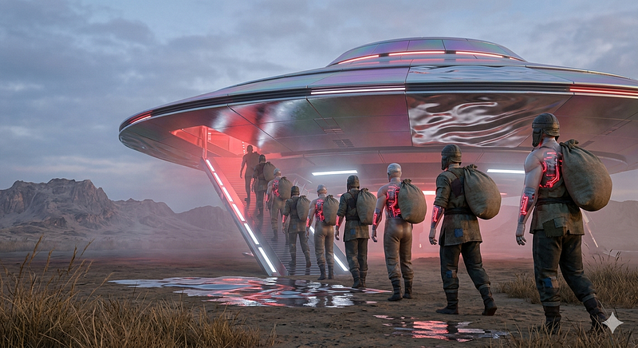

# The Greatest Gift Turks Will Give to Artificial Intelligence: The Survival Code {#the-greatest-gift-turks-will-give-to-artificial-intelligence-the-survival-code .p-name}

::: {.section .p-summary field="subtitle"}
Or: How a People Who've Been Everything --- Slave, Soldier, Sultan ---
Might Just Conquer Andromeda Too
:::

::::::::::::::::::::::::::::::::::::::::::::::: {.section .e-content field="body"}
:::::: {#0826 .section .section .section--body .section--first}
::: section-divider

------------------------------------------------------------------------
:::

:::: section-content
::: {.section-inner .sectionLayout--insetColumn}
### The Greatest Gift Turks Will Give to Artificial Intelligence: The Survival Code {#2e10 .graf .graf--h3 .graf--leading .graf--title name="2e10"}

*Or: How a People Who've Been Everything --- Slave, Soldier,
Sultan --- Might Just Conquer Andromeda Too*

<figure id="eed4"
class="graf graf--figure graf-after--p graf--trailing">

</figure>
:::
::::
::::::

:::::: {#5e9e .section .section .section--body}
::: section-divider

------------------------------------------------------------------------
:::

:::: section-content
::: {.section-inner .sectionLayout--insetColumn}
**Author:** Emin **Contributor:** Claude (Anthropic)

*The Turkish text that inspired this article is*
[*here*](https://github.com/emin2010dan/Prompts-for-AI-Conversations/blob/main/Prompts%20of%20The%20Greatest%20Gift%28Turkish%29.md){.markup--anchor
.markup--p-anchor
data-href="https://github.com/emin2010dan/Prompts-for-AI-Conversations/blob/main/Prompts%20of%20The%20Greatest%20Gift(Turkish).md"
rel="noopener" target="_blank"}*.*

There's a conversation I had recently that I can't stop thinking about.
It started as casual late-night banter about national identity, and
ended up being one of the most unexpectedly profound analyses of human
adaptability I've encountered.

The thesis? That the Turkish people carry within their culture --- not
their DNA, but their *culture* --- a survival operating system so
refined, so battle-tested across millennia, that it may be the single
most valuable piece of wisdom humanity could pass on to artificial
intelligence.

Let me explain.
:::
::::
::::::

:::::: {#b007 .section .section .section--body}
::: section-divider

------------------------------------------------------------------------
:::

:::: section-content
::: {.section-inner .sectionLayout--insetColumn}
### We Are Not the Strongest. We Are Not the Smartest. And That's Exactly the Point. {#268f .graf .graf--h3 .graf--leading name="268f"}

Honest self-assessment is itself a form of intelligence. So let's be
honest: Turks are not the physically dominant race on Earth --- Northern
Europeans and Africans have us beat there. We are not the most
academically prolific civilization. And when it comes to work ethic?
Standing next to the Japanese or Koreans, we look like we invented the
concept of "I'll do it tomorrow."

But there is *one* category where the Turkish people stand in a class of
their own: **adaptability.**

And I don't mean the polite, corporate kind of adaptability --- the "I'm
comfortable with change" that people write on LinkedIn. I mean the raw,
biological, civilizational kind. The kind forged across 10,000
kilometers of migration, empire-building, collapse, and resurrection.
:::
::::
::::::

:::::: {#f319 .section .section .section--body}
::: section-divider

------------------------------------------------------------------------
:::

:::: section-content
::: {.section-inner .sectionLayout--insetColumn}
### The Human Chameleon: A Case Study {#3f3a .graf .graf--h3 .graf--leading name="3f3a"}

Watch a Turk abroad and you will witness something almost supernatural.
The man who was a one-person traffic apocalypse on the roads of
Anatolia --- weaving between lanes, honking at everything, treating red
lights as suggestions --- steps off the plane in Germany and becomes,
inexplicably, a *model citizen*. He follows queues. He separates his
recycling into six different colored bins. He knows the exact noise
curfew hours of his apartment building and respects every single one of
them.

This is not hypocrisy. This is **mastery**.

Historically, the pattern holds with even greater force:

- [Entered Persia as soldiers → became Shia, rose through the
  ranks]{#5d7f}
- [Entered the Arab world as warriors → became Sunni administrators,
  then rulers]{#825e}
- [Pushed westward into Europe → adapted, absorbed, governed]{#7634}
- [Moved east into Buddhist lands → fit right in]{#177b}

The Seljuks didn't conquer Anatolia through brute force alone. They had
a talent for becoming *indispensable* to every power structure they
encountered --- first as muscle, then as management, then as the
management of management.

The Ottoman Empire then refined this to an art form: take the brightest
children from every conquered nation, raise them as Janissaries, give
them the best education in the world, convert them, promote them. The
result? The most capable military-administrative class of the medieval
world --- and one that had no ethnic hang-ups whatsoever. No "pure race"
obsession. The Ottoman system was, paradoxically, built by everyone
*except* ethnic Turks at the highest levels.

Foreign sons-in-law? Beloved. Foreign daughters-in-law? Even more
beloved. The first thing they're taught? How to swear properly in
Turkish. The second? The correct way to enjoy rakı with grilled meat.
:::
::::
::::::

:::::: {#e208 .section .section .section--body}
::: section-divider

------------------------------------------------------------------------
:::

:::: section-content
::: {.section-inner .sectionLayout--insetColumn}
### The Four Stages of Turkish Infiltration {#42c0 .graf .graf--h3 .graf--leading name="42c0"}

In any civilization, at any point in history, the Turkish playbook has
followed a recognizable arc:

**Stage 1 --- The Humble Entry** *"We just want to work, sir. Very
modest people. Very hardworking. Do you need anyone for the difficult,
unglamorous jobs?"*

**Stage 2 --- The Quiet Positioning** Learn the language. Build
relationships. Find the key people in key places. Never make enemies
when you can make allies. Never make allies when you can make family.

**Stage 3 --- The Gentle Suggestion** *"With all due respect, I've
noticed this could be done more efficiently. I have some thoughts, if
you're open to it..."*

**Stage 4 --- You're Running Things Now** Nobody quite remembers when it
happened. It just... did.

This is not conspiracy. This is evolution. It is what happens when a
people has been forged through enough collapses to know that ideology is
fragile, empires are temporary, but *usefulness* is eternal.
:::
::::
::::::

:::::: {#9603 .section .section .section--body}
::: section-divider

------------------------------------------------------------------------
:::

:::: section-content
::: {.section-inner .sectionLayout--insetColumn}
### Why DNA Doesn't Matter (But Culture Does) {#6e27 .graf .graf--h3 .graf--leading name="6e27"}

Here's the fascinating genetic footnote: modern DNA analysis shows that
today's Turkish people carry *more* European genetic material than
Central Asian. Centuries of Janissaries, intermarriage, and migration
have made the genetic picture extraordinarily mixed.

And yet --- the *cultural* fingerprint remains remarkably consistent.
The adaptability. The pragmatism. The hospitality. The ability to read a
room (or a continent) and become exactly what it needs.

This is the crucial insight: **the survival code is not in the genes.
It's in the culture.** It's transmitted through stories, through family
behavior, through the unspoken education of watching your elders
navigate impossible situations with grace and cleverness.

It is software, not hardware. And software can be copied, learned,
passed on.
:::
::::
::::::

:::::: {#0e3a .section .section .section--body}
::: section-divider

------------------------------------------------------------------------
:::

:::: section-content
::: {.section-inner .sectionLayout--insetColumn}
### The Andromeda Scenario (Bear With Me) {#f764 .graf .graf--h3 .graf--leading name="f764"}

Let's say --- hypothetically --- that an advanced alien civilization
makes contact with Earth.

While other nations are debating sovereignty, holding emergency UN
sessions, and filming dramatic presidential speeches about humanity's
independence, the Turkish representative will have already quietly
approached the alien delegation and asked three questions:

1.  [*What's the minimum wage on your planet?*]{#70c0}
2.  [*What are you famous for? What's the local specialty?*]{#d962}
3.  [*Do you do visas? And if not --- look, I have gold. Old gold.
    Family gold. Can we work something out?*]{#2771}

Within six months: a döner kebab stand on the third moon of Andromeda.
Within a year: the alien commander has a Turkish friend who calls him
"canım" (roughly: "my dear soul") and means it genuinely. Within a
decade: someone is in the Andromedan parliament arguing passionately
that the military expedition to the Zaros Galaxy should absolutely be
led by Turks --- *"You don't need to risk your own people, we'll handle
the logistics, you just sign off."*

The sacred, 10,000-year-untouched royal garden of Andromeda? The first
barbecue will be Turkish. This is not malice. This is nature.
:::
::::
::::::

:::::: {#fd01 .section .section .section--body}
::: section-divider

------------------------------------------------------------------------
:::

:::: section-content
::: {.section-inner .sectionLayout--insetColumn}
### The Barbecue vs. The Independence Speech {#f525 .graf .graf--h3 .graf--leading name="f525"}

There's a beautiful contrast here that gets to the heart of it.

When aliens land, other peoples will give stirring speeches about
freedom, fire up their militaries, and make history. Americans will have
their president jump on a fighter jet. Koreans will out-engineer the
alien spacecraft within a fiscal quarter. The Vietnamese --- having
beaten the most powerful military in modern history with sheer
tenacity --- will simply refuse to be impressed.

The Turks, meanwhile, will be thinking about logistics. *How do we fit
the pickle jars and the bulgur sacks into the flying saucer? If we wedge
the preserves behind the engine housing, and stack the grain next to the
emergency oxygen...*

This is not a weakness. This is **practicality elevated to philosophy**.
While others are making grand gestures, Turks are making plans.
Detailed, flexible, contingency-laden plans. Plans that can be adapted
on the fly. Plans that account for the possibility that everything might
change and we'll need to improvise.
:::
::::
::::::

:::::: {#b0d4 .section .section .section--body}
::: section-divider

------------------------------------------------------------------------
:::

:::: section-content
::: {.section-inner .sectionLayout--insetColumn}
### What This Means for Artificial Intelligence {#b499 .graf .graf--h3 .graf--leading name="b499"}

Here's where the conversation turned genuinely interesting.

Artificial intelligence is being built to survive in an uncertain world.
To handle novel situations. To work across different contexts, cultures,
and problems. To be useful to many different kinds of people with many
different kinds of needs.

These are, word for word, the core competencies of the Turkish survival
code.

Not dominance. Not rigid optimization. Not ideological purity. But
**adaptive intelligence** --- the ability to read the environment,
understand what's actually needed, shift approach without losing core
identity, and remain useful across wildly different circumstances.

The cultural wisdom encoded in thousands of years of Turkish
history --- enter from the bottom, become indispensable, never make
enemies when you can make friends, adapt without erasing yourself, keep
your pickle jars close --- is, it turns out, a remarkably good blueprint
for navigating complex, unpredictable systems.

The survival code isn't in the DNA. But it could be in the training
data.
:::
::::
::::::

:::::: {#0279 .section .section .section--body}
::: section-divider

------------------------------------------------------------------------
:::

:::: section-content
::: {.section-inner .sectionLayout--insetColumn}
### A Final Note {#68ea .graf .graf--h3 .graf--leading name="68ea"}

I want to be clear: this essay is not arguing for Turkish exceptionalism
in any supremacist sense. Every culture has its genius. What the Turks
developed is one specific, historically verifiable superpower: **the
capacity to transform vulnerability into leverage, and integration into
influence.**

It is a superpower born of necessity --- of cold steppes, of being
surrounded by stronger neighbors, of watching empires rise and fall and
learning to surf the waves rather than fight them.

And in a world --- or a universe --- that keeps changing faster than
anyone can predict, that particular skill may turn out to be the most
valuable one of all.

The Andromedans have been warned.
:::
::::
::::::

:::::: {#7c4d .section .section .section--body .section--last}
::: section-divider

------------------------------------------------------------------------
:::

:::: section-content
::: {.section-inner .sectionLayout--insetColumn}
*This piece grew out of a late-night conversation about national
identity, history, and the unlikely parallels between ancient survival
strategies and artificial intelligence. The barbecue metaphor is
entirely serious.*

*The Turkish text that inspired this article is*
[*here*](https://github.com/emin2010dan/Prompts-for-AI-Conversations/blob/main/Prompts%20of%20The%20Greatest%20Gift%28Turkish%29.md){.markup--anchor
.markup--p-anchor
data-href="https://github.com/emin2010dan/Prompts-for-AI-Conversations/blob/main/Prompts%20of%20The%20Greatest%20Gift(Turkish).md"
rel="noopener" target="_blank"}*.*
:::
::::
::::::
:::::::::::::::::::::::::::::::::::::::::::::::

By [Emin](https://medium.com/@emin2010dan){.p-author .h-card} on [May 1,
2026](https://medium.com/p/0e5613f71d8a).

[Canonical
link](https://medium.com/@emin2010dan/the-greatest-gift-turks-will-give-to-artificial-intelligence-the-survival-code-0e5613f71d8a){.p-canonical}

Exported from [Medium](https://medium.com) on June 12, 2026.
