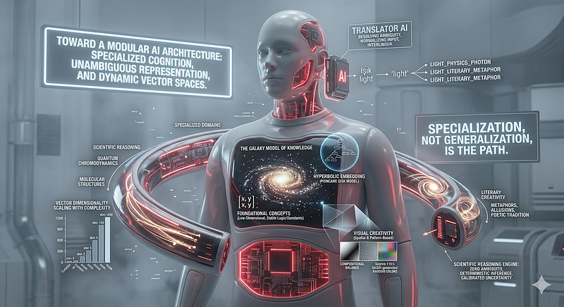

# Toward a Modular AI Architecture: Specialized Cognition, Unambiguous Representation, and Dynamic...

A Conceptual Framework for Next-Generation AI Systems

------------------------------------------------------------------------

### **Toward a Modular AI Architecture:** Specialized Cognition, Unambiguous Representation, and Dynamic Vector Spaces

<figure id="7a98" class="graf graf--figure graf-after--h3">

</figure>

*A Conceptual Framework for Next-Generation AI Systems*

**Discussion Paper**

Emin • Contributor: Claude (Anthropic)

2026

### Abstract

*Contemporary large language models (LLMs) attempt to unify literary
creativity, visual imagination, and scientific reasoning within a single
monolithic architecture. This paper argues that such unification is not
merely inefficient but fundamentally misaligned with the distinct
cognitive structures that each domain requires. We propose a layered,
modular AI ecosystem composed of three principal components: (1) a
Translator AI that resolves natural-language ambiguity and normalizes
cross-lingual input into an unambiguous internal representation; (2)
domain-specialized Reasoning AI engines --- scientific, literary, and
visual --- each operating on representations suited to their domain; and
(3) a dynamic vector-space model in which vector dimensionality scales
with the conceptual complexity and domain depth of each term. Drawing on
analogies from neuroscience, linguistics, information theory, and the
history of computing, we argue that specialization --- not
generalization --- is the path toward AI systems that are both more
capable and more interpretable. The hallucination problem endemic to
current LLMs is reframed not as a training failure but as an
architectural inevitability of forcing incompatible cognitive modes into
a single representational space.*

### 1. Introduction

Modern AI research has pursued a seductive goal: a single model capable
of doing everything. GPT-4, Gemini, and Claude can write poetry, solve
differential equations, generate code, and describe images --- sometimes
in the same response. This versatility is impressive, but it comes at a
cost that is rarely examined critically.

Consider what happens when a human brain specialist attempts to write a
novel, or when a celebrated poet is asked to derive a quantum field
theory. The cognitive structures optimized for one domain actively
interfere with the other. Neuroscience has long recognized that
scientific reasoning and creative cognition rely on distinct and
sometimes antagonistic neural networks. The prefrontal cortex drives
systematic logical inference; the default mode network drives
associative, metaphorical, and narrative thinking. Excellence in one
domain correlates weakly --- and sometimes negatively --- with
excellence in the other.

Current AI architectures ignore this lesson entirely. By training a
single transformer on the full spectrum of human output --- scientific
papers, novels, code, jokes, legal documents, and casual
conversation --- we produce systems that are mediocre at everything in a
way that is difficult to detect, because their mediocrity is averaged
across domains. The hallucinations that plague these systems are not
bugs to be patched; they are symptoms of a deeper architectural category
error.

This paper develops an alternative vision, one that emerged from a
series of reflections on how language, meaning, and knowledge are
actually structured. We propose that the next generation of AI systems
should be modular ecosystems rather than monolithic models, with
explicit architectural separation between translation, reasoning, and
generation --- and with representational schemes that match the
structural demands of each cognitive domain.

### 2. The Problem of Polysemy in AI Representation

### 2.1 One Word, Multiple Worlds

The word "light" illustrates the problem with unusual clarity. In
physics, light is an electromagnetic phenomenon characterized by
wavelength, frequency, photon energy, and propagation speed. In poetry,
light is a metaphor for understanding, hope, revelation, or divine
presence. In photography, light is a practical resource --- direction,
temperature, quality, quantity. In everyday speech, light can mean not
heavy, not dark, not serious, or a cigarette flame.

A human reader disambiguates these senses effortlessly because
contextual cues are processed at multiple cognitive levels
simultaneously: syntactic position, surrounding vocabulary, discourse
genre, speaker identity, and prior conversational history all
contribute. Current LLMs approximate this disambiguation
statistically --- they assign a probability distribution over possible
senses --- but they never resolve the ambiguity definitively. A single
embedding vector for "light" must somehow encode all of these senses
simultaneously, which is geometrically impossible without loss.

The field of Word Sense Disambiguation (WSD) has grappled with this
problem for decades without a satisfying solution. We argue that WSD
cannot be solved at the representation level within a monolithic
architecture; it requires a dedicated disambiguation layer that operates
before the reasoning layer receives any input.

### 2.2 Cross-Linguistic Structural Variation

The problem deepens when we consider cross-lingual input. Turkish is a
Subject-Object-Verb (SOV) agglutinative language; English is
Subject-Verb-Object (SVO) and largely isolating; Japanese employs
topic-comment structure with extensive contextual ellipsis; Arabic is
highly inflected with root-and-pattern morphology. These are not merely
different orderings of the same underlying content --- they reflect
different ways of segmenting and relating conceptual structure.

A Reasoning AI that receives raw Turkish input and raw English input
must maintain separate representations for what are, conceptually, the
same thoughts. The interlingua tradition in machine
translation --- producing a single canonical meaning representation
independent of surface language --- was abandoned in the 1990s because
the available technology could not construct adequate interlingual
representations. We propose that this abandonment was premature, and
that a dedicated Translator AI operating as a preprocessing layer can
now construct such representations with sufficient fidelity.

### 3. The Translator AI: Disambiguation and Normalization

### 3.1 Role and Responsibilities

The Translator AI occupies the boundary between human natural language
and the internal representation system used by Reasoning AI engines. Its
responsibilities are:

- [Sense disambiguation: determining which of multiple possible meanings
  a polysemous word carries in context, and replacing it with an
  unambiguous internal token (e.g., light → LIGHT_PHYSICS_PHOTON or
  LIGHT_LITERARY_METAPHOR).]
- [Syntactic normalization: converting the surface syntax of any input
  language into a canonical logical form, stripping away
  language-specific word-order conventions.]
- [Domain tagging: identifying the knowledge domain(s) relevant to the
  query and routing the normalized representation to the appropriate
  Reasoning AI engine.]
- [Register and intent classification: distinguishing, for example,
  between a factual scientific query and an emotionally expressive
  literary request, so that the appropriate reasoning mode is
  activated.]

### 3.2 The Bootstrap Problem

A natural objection arises: in order to disambiguate language, the
Translator AI must itself understand language, including its
ambiguities. This appears circular. We address this by noting that
disambiguation and reasoning are distinct cognitive operations with
different tolerance profiles. The Translator AI is explicitly permitted
to maintain probabilistic uncertainty about meaning --- it must only
reduce that uncertainty below the threshold at which the Reasoning AI's
strict unambiguity requirement would be violated. A Translator AI that
is 95% confident about the correct sense is operationally sufficient;
the Reasoning AI need never be exposed to residual ambiguity.

This division of labor --- where the Translator AI tolerates controlled
ambiguity and the Reasoning AI admits none --- is analogous to how a
skilled interpreter operates at a multilateral conference: the
interpreter may occasionally be uncertain which of two readings a
speaker intends, but they make a definitive choice before voicing it,
never transmitting uncertainty into the formal record.

### 4. Dynamic Vector Spaces and the Galaxy Model of Knowledge

### 4.1 The Fixed-Dimensionality Problem

All current embedding models assign a fixed-dimensional vector to every
token regardless of conceptual complexity. In GPT-4-class models, this
dimensionality is on the order of 12,000--16,000. The word "cat" and the
phrase "quantum chromodynamic asymptotic freedom" receive vectors of
identical length. From an information-theoretic standpoint, this is
clearly suboptimal: simple, high-frequency, context-stable concepts
require fewer dimensions to be adequately represented, while complex,
domain-specific, context-sensitive concepts require more.

The fixed-dimensionality constraint exists for sound engineering
reasons: matrix multiplication requires uniform vector dimensions, GPU
parallelism is optimized for fixed tensor shapes, and cosine similarity
is only defined for equal-length vectors. These constraints are real.
Our proposal does not deny them; rather, it reframes the question.

### 4.2 The Galaxy Metaphor

We propose conceptualizing the knowledge space of a Reasoning AI as a
galaxy-like structure with the following properties:

- [Core (galactic center): Foundational concepts that underlie all
  domains --- basic logical operators, fundamental physical constants,
  elementary mathematical objects. These concepts are semantically
  stable, rarely ambiguous, and require low-dimensional
  representations.]
- [Inner orbits: Domain-general scientific concepts --- atomic elements,
  geometric primitives, basic biological taxa. Moderate dimensionality,
  within-domain cross-referencing frequent.]
- [Outer arms: Highly specialized domain-specific concepts --- the
  optical reflectance properties of a particular automotive coating
  formulation, the prosodic conventions of a specific poetic tradition.
  High dimensionality, cross-domain interaction rare.]
- [Sparse inter-arm regions: Concepts from distant domains that have
  negligible semantic overlap. Computation between these regions is not
  merely unnecessary --- it is actively misleading, because the distance
  metric between unrelated high-dimensional vectors is dominated by
  noise.]

### 4.3 Computational Realization

The technical realization of variable-dimensionality vectors within a
computation-friendly framework can be approached in several ways.
Projection layers can temporarily expand shorter vectors for
cross-concept operations when needed, then discard the added dimensions
afterward. Sparse attention mechanisms --- already employed in models
such as Longformer and BigBird --- implement a related idea: not every
concept needs to attend to every other concept. Mixture-of-Experts (MoE)
architectures, used in GPT-4 and Gemini, provide a complementary
approach: routing different inputs to different expert sub-networks, so
that the "BMW mirror coating" query never activates the chemistry
sub-network and vice versa.

The most mathematically natural realization of the galaxy model,
however, is hyperbolic embedding. In hyperbolic space (as opposed to the
flat Euclidean space used by current embeddings), hierarchical
relationships --- parent concept to child concept --- are preserved with
exponentially greater efficiency. The Poincaré Embeddings work of Nickel
and Kiela (2017) demonstrated that a 5-dimensional hyperbolic embedding
can represent hierarchical structures that require hundreds of Euclidean
dimensions. The galaxy metaphor maps naturally onto the geometry of the
Poincaré disk: the center represents the most general concepts; the
boundary represents the most specific.

### 4.4 Lexical Density as a Signal of Conceptual Complexity

A principled method for determining appropriate vector dimensionality is
available from a surprising source: the lexical density of a domain. The
Inuit peoples possess dozens of distinct terms for varieties of snow and
ice --- not because their language is arbitrary, but because
fine-grained distinctions within that conceptual space are practically
important. Medical specialists distinguish hundreds of distinct cell
morphologies with dedicated terminology. Financial law has precise terms
for instruments that everyday language collapses into "investment."

Lexical density --- the number of distinct terms a domain uses to
subdivide a conceptual space --- is therefore a natural proxy for the
dimensionality required to represent that space without collision. A
domain with n specialized sub-terms for a concept requires at minimum
log₂(n) dimensions to distinguish them without overlap; in practice, the
requirement is higher because concepts exist in relation to one another,
not independently. This principle provides an empirically grounded,
domain-sensitive method for assigning vector dimensionality that
requires no human annotation.

### 5. Three Reasoning Architectures

### 5.1 Scientific Reasoning AI

The Scientific Reasoning AI operates on the canonical internal
representation produced by the Translator AI. Its defining properties
are:

- [Zero tolerance for semantic ambiguity: every token maps to exactly
  one referent.]
- [Deterministic inference chains: for a given input, the reasoning path
  is reproducible and inspectable.]
- [Domain-partitioned vector spaces: concepts from unrelated domains do
  not interact, eliminating cross-domain noise.]
- [Calibrated uncertainty: when evidence is insufficient, the system
  returns a probability estimate with explicit confidence intervals, not
  a confabulated answer.]

Asking this system for a poem is not merely unhelpful --- it is a
category error, and the system should recognize it as such and route the
request back to the Translator AI for redirection.

### 5.2 Literary Creativity AI

Literary creativity requires precisely the properties that the
Scientific Reasoning AI excludes:

- [Productive ambiguity: a single expression carrying multiple
  simultaneous meanings is a feature, not a bug.]
- [Associative reasoning: meaning emerges from unexpected
  juxtapositions; the system must traverse conceptual distances that a
  scientific reasoner would mark as irrelevant.]
- [Cultural and historical depth: metaphors, allusions, tonal registers,
  and genre conventions are first-class representational
  elements.]
- [Tolerance for incompleteness: a poem that is not fully explicable is
  not a failed poem.]

Current LLMs produce poetry that is technically competent but rarely
surprising. This is precisely what one would predict from a system
trained to minimize prediction error across a vast corpus: the outputs
converge on high-probability continuations. A dedicated Literary AI with
an architecture optimized for low-probability, high-semantic-distance
connections would produce qualitatively different --- and qualitatively
richer --- creative output.

### 5.3 Visual Creativity AI

Visual creativity presents a third distinct case. An important
historical data point: a BASIC program running on an Apple II in 1985
that generated random colors and positions could produce visually
striking, genuinely creative outputs. Its creativity was not diminished
by its simplicity; in fact, its constraints --- limited palette,
grid-based geometry, systematic variation --- produced aesthetic effects
that contemporary text-conditioned image generators, despite their
vastly greater complexity, frequently fail to match.

This observation suggests that visual creativity may not require
symbolic language processing at all. The representational substrate for
visual generation may be fundamentally spatial and
pattern-based --- operating on texture gradients, compositional balance,
color harmonics, and rhythm --- rather than on linguistic tokens. A
Visual Creativity AI that bypasses the token-embedding pipeline entirely
and operates directly on spatial representations may outperform
text-conditioned models precisely because it does not need to translate
between incompatible representational formats.

### 6. The Modular AI Ecosystem

### 6.1 Architecture Overview

The full architecture proposed here comprises the following layers:

- [Human Interface Layer: receives raw natural language input in any
  language, any register, any domain.]
- [Translator AI: disambiguates, normalizes, domain-tags, and
  routes.]
- [Reasoning AI Engines (parallel, specialized): Scientific, Literary,
  Visual, and potentially others (Legal, Mathematical,
  Interpersonal).]
- [Synthesis Layer: integrates outputs from multiple Reasoning AI
  engines when a query spans domains.]
- [Output Translator: converts the internal representation back into the
  appropriate human language and register.]

### 6.2 Separation of Concerns as Engineering Principle

Software engineers recognize separation of concerns as one of the most
powerful principles in system design: each component should be
responsible for exactly one well-defined function, with clean interfaces
between components. Current monolithic LLMs violate this principle
wholesale: disambiguation, reasoning, memory retrieval, tone management,
factual recall, and response generation all occur within the same
undifferentiated weight matrix.

The modular architecture proposed here applies separation of concerns at
the cognitive level. Each component can be developed, evaluated, and
improved independently. Errors can be localized: if the Scientific
Reasoning AI produces a wrong answer, the diagnosis begins with whether
the Translator AI provided it a correctly disambiguated representation,
or whether the reasoning engine itself failed. This debuggability is
nearly absent in current systems.

### 6.3 Hallucination as Architectural Symptom

The hallucination problem in current LLMs --- confident generation of
factually incorrect statements --- has been attributed to training data
quality, reinforcement learning from human feedback misalignment, and
insufficient factual grounding. These attributions are partly correct
but miss a deeper cause: when a single architecture is required to be
both a confident factual retriever and a fluent creative generator, it
will inevitably blend these modes in ways that are difficult to detect
and impossible to fully prevent.

A Scientific Reasoning AI that is architecturally prohibited from
generating plausible-sounding text when knowledge is absent --- one that
can only output "insufficient evidence" or a probability
estimate --- cannot hallucinate in the problematic sense. Hallucination
is a property of systems that treat confident generation as a universal
output modality. Eliminating it requires not better training but
architectural constraint.

### 7. Relation to Existing Research

Several threads of existing research converge on components of the
framework proposed here, though none combines them in the way we
describe.

**Hyperbolic embeddings.** Nickel and Kiela's Poincaré Embeddings
(NeurIPS 2017) demonstrated the superior efficiency of hyperbolic space
for representing hierarchical knowledge. Subsequent work has extended
this to more complex ontologies. The galaxy model proposed here is
directly inspired by the geometry of the Poincaré disk, with the
generality axis corresponding to distance from the origin.

**Mixture of Experts.** MoE architectures (Shazeer et al., 2017; used in
GPT-4 and Gemini) implement domain routing at the sub-network level. Our
proposal generalizes this to the inter-system level, with fully separate
architectures rather than shared-weight expert modules.

**Sparse attention.** Longformer, BigBird, and related models implement
the intuition that not all token pairs require mutual attention. The
galaxy model extends this to the inter-concept level: concepts from
distant semantic domains should not interact.

**Interlingua.** The interlingua tradition in machine translation
(1970s--1990s) pursued language-independent meaning representation. The
Translator AI proposed here is a modern successor to this tradition,
enabled by capabilities unavailable to its predecessors.

**Google Pathways.** Google's Pathways architecture (Dean, 2021)
proposed sparse activation across a large shared model, with different
inputs activating different computational paths. Our proposal is more
radical: rather than sparse paths through a shared architecture, we
advocate fully separate architectures with a dedicated coordination
layer.

### 8. Implications and Open Questions

### 8.1 For AI Safety

A modular architecture with explicit separation between reasoning modes
may have significant safety implications. A Scientific Reasoning AI that
cannot generate persuasive natural language directly is less capable of
producing disinformation, manipulation, or deceptive outputs than a
system in which factual retrieval and fluent generation are unified.
Safety constraints can be implemented at the architectural level rather
than as post-hoc filters on an inherently unconstrained generative
system.

### 8.2 For Interpretability

One of the most significant obstacles to AI interpretability is that
current LLMs perform all cognitive operations in the same
undifferentiated activation space. Modular systems with clean interfaces
between components enable interpretability at each interface: one can
inspect the internal representation that the Translator AI produces,
verify that it correctly disambiguated the input, and separately audit
the reasoning chain of the Scientific Reasoning AI. This layered
interpretability is qualitatively more tractable than end-to-end
black-box explanation.

### 8.3 Open Questions

- [How should concepts that span domain boundaries (quantum biology,
  computational linguistics, computational creativity) be represented in
  a galaxy-structured knowledge space?]
- [Can the conceptual complexity and domain membership of a token be
  estimated automatically from corpus statistics, or does it require
  human annotation?]
- [What is the optimal architecture for the Synthesis Layer that
  integrates outputs from multiple Reasoning AI engines?]
- [How should the system handle queries whose domain classification is
  genuinely uncertain --- e.g., a philosophical question about the
  nature of light that is neither purely scientific nor purely
  literary?]

### 9. Conclusion

We have argued that the monolithic approach to AI architecture --- a
single model trained on the full spectrum of human cognitive
output --- produces systems that are mediocre at everything in a way
that is difficult to detect and impossible to fully repair through
training alone. The hallucination problem, the ambiguity problem, and
the creative shallowness problem are symptoms of a common architectural
cause.

The alternative we propose is a modular ecosystem in which a Translator
AI resolves natural-language ambiguity and routes normalized
representations to domain-specialized Reasoning AI engines, each
operating on a knowledge space whose vector dimensionality is calibrated
to the structural complexity of its domain. The geometry of this
knowledge space is galaxy-like: foundational concepts at the center with
compact representations, specialized concepts at the periphery with
richer ones, and sparse interaction between distant domains.

This vision is informed by a convergence of insights: from neuroscience
(distinct neural circuits for distinct cognitive modes), from
linguistics (the interlingua tradition and word sense disambiguation),
from information theory (lexical density as a proxy for representational
complexity), from the history of computing (the 1985 Apple II BASIC
program as a case study in the power of constrained creativity), and
from software engineering (separation of concerns as a design principle
for robust, interpretable, maintainable systems).

The path to AI systems that are genuinely capable, reliably accurate,
and safely deployable runs not through larger monolithic models but
through principled specialization. Nature arrived at this conclusion
through millions of years of evolution. We can afford to learn the
lesson more quickly.

**Note on Origin**

*This paper is the written formalization of ideas developed in
conversation by a retired computer engineer. The original
insights --- the galaxy model of dynamic vector spaces, the Translator
AI as disambiguation layer, the tripartite specialization of creative
architectures, and the lexical-density principle for dimensionality
assignment --- emerged from their reflective engagement with
foundational questions in AI design. The author's career, spanning the
era from early personal computing to the present, provides a perspective
that younger practitioners rarely possess: the memory of what it felt
like when a simple, well-scoped program did exactly what it was designed
to do, and did it beautifully.*

By [Emin](https://medium.com/@emin2010dan) on [April
21, 2026](https://medium.com/p/5879add222a1).

[Canonical
link](https://medium.com/@emin2010dan/toward-a-modular-ai-architecture-specialized-cognition-unambiguous-representation-and-dynamic-5879add222a1)

Exported from [Medium](https://medium.com) on June 12, 2026.
